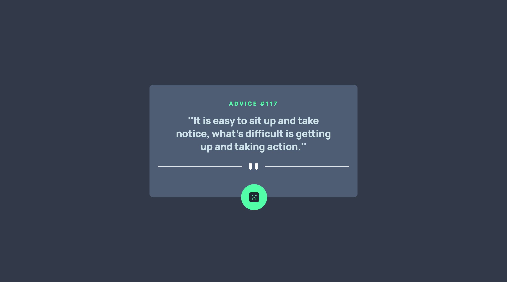
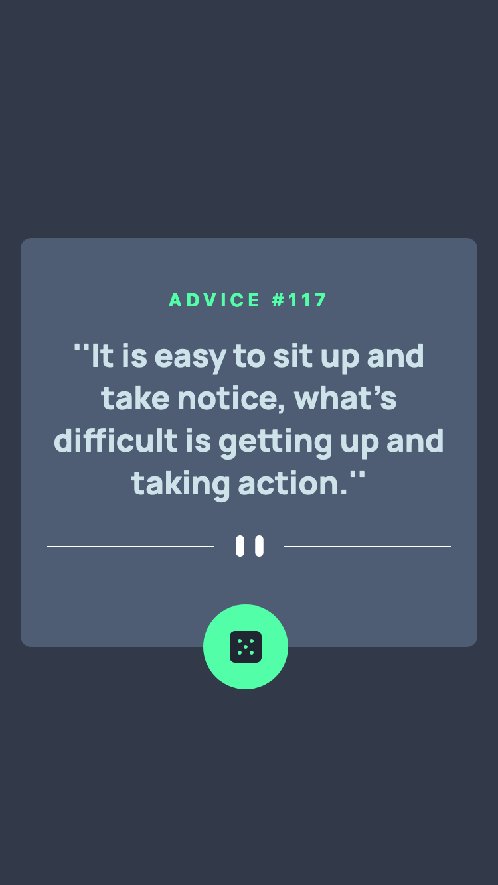

# Frontend Mentor - Advice generator app solution

This is a solution to the [Advice generator app challenge on Frontend Mentor](https://www.frontendmentor.io/challenges/advice-generator-app-QdUG-13db). Frontend Mentor challenges help you improve your coding skills by building realistic projects.

## Table of contents

-   [Overview](#overview)
    -   [The challenge](#the-challenge)
    -   [Screenshot](#screenshot)
    -   [Links](#links)
-   [My process](#my-process)
    -   [Built with](#built-with)
    -   [What I learned](#what-i-learned)
    -   [Useful resources](#useful-resources)

## Overview

### The challenge

Users should be able to:

-   View the optimal layout for the app depending on their device's screen size
-   See hover states for all interactive elements on the page
-   Generate a new piece of advice by clicking the dice icon

### Screenshot

|  |  |
| ------------------------------------------------------------- | ------------------------------------------------------------ |

### Links

-   [My Solution]()
-   [Live Site URL]()

## My process

### Built with

-   Semantic HTML5 markup
-   CSS custom properties
-   Flexbox
-   CSS Grid
-   Mobile-first workflow
-   Tailwind CSS
-   [React](https://react.dev/) - JS library

### What I learned

I learned how to apply useState(), jsx, props and other react.js fundamentals.

### Useful resources

#### - [Stackoverflow](https://stackoverflow.com/) - This is a great site for solutions to your problems, especially if you get stucked.

#### - [MDN DOCS](https://developer.mozilla.org/) - This is an amazing site to read about the documentations of html, css and javascript properties.

#### - [Google Fonts](https://fonts.google.com/) - For all kinds of font styles, this is highly recommended.

#### - [Tailwind css](https://tailwindcss.com/) - The official tailwind css documentation.
